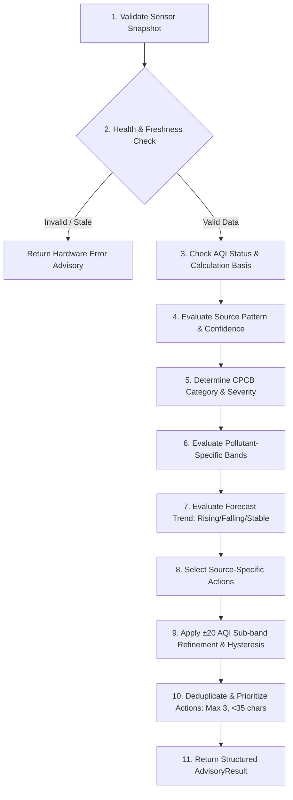

# NavosEdge — Dynamic Advisory & Action Engine Design

## 1. Architectural Philosophy

The NavosEdge Advisory Engine is a deterministic, multi-layer rule evaluation system. It takes raw and derived environmental intelligence (AQI, particulate concentrations, classified sources, forecast trends, weather metrics) and produces actionable, user-centric health advice and discrete steps.

Key Design Tenets:
- **Zero Hallucination**: Does not use generative LLMs at runtime on the edge device; decisions are deterministic and reproducible.
- **Safety-First Invalidation**: If sensors are disconnected, stale, or reporting corrupt frames, it immediately suppresses health advice and directs the user to inspect hardware.
- **Display Optimization**: Actions are strictly bounded in length ($\le 34$ characters) and count ($\le 3$ items) to guarantee clean, unclipped rendering on the 480×320 SPI display.
- **Hysteresis & Anti-Flicker**: Incorporates state-aware hysteresis to avoid rapid flip-flopping of text when readings hover near band boundaries.

---

## 2. The 11-Step Decision Order

The engine executes in strict sequential order:

### Detailed Decision Pipeline Steps:
1. **Validate Sensor Snapshot**: Verify that the incoming dictionary is non-null and possesses valid structural keys.
2. **Health & Freshness Check**:
   - Check `is_valid` flag, transport error status (`invalid`, `corrupted`, `stale`, `not_available`), or absence of particulate measurements.
   - If unhealthy: immediately return:
     - `severity`: `"NORMAL"`
     - `advice`: `"Sensor data is unavailable. Check the connection."`
     - `actions`: `["Check sensor connection."]`
     - `weather_advice`: `""`
   - *Crucial Rule: Never generate public health advice from invalid or fabricated data.*
3. **AQI Status & Calculation Basis**: Recognize whether the index is an official CPCB AQI ($\ge 3$ regulatory parameters) or a `PM_BASED_ESTIMATE`.
4. **Source Classification Pattern & Confidence**:
   - Evaluate model confidence against `source_confidence_minimum` ($0.60$).
   - If confidence is low or source is `UNKNOWN`, treat as unconfirmed; restrict advice to general ambient precautions.
   - If confidence $\ge 0.60$, activate source-targeted mitigations.
5. **CPCB Category & Severity Level**:
   - Map Indian AQI to severity:
     - Good ($0–50$) $\rightarrow$ `NORMAL`
     - Satisfactory ($51–100$) $\rightarrow$ `MODERATE`
     - Moderate ($101–150$) $\rightarrow$ `HIGH`
     - Poor / Moderate-upper ($151–200$) $\rightarrow$ `SEVERE`
     - Very Poor / Severe ($201+$) $\rightarrow$ `CRITICAL`
6. **Pollutant-Specific Concentration Bands**: Detect whether $\text{PM}_{2.5}$ fine soot ($>90\ \mu\text{g/m}^3$) or $\text{PM}_{10}$ coarse dust ($>180\ \mu\text{g/m}^3$) is the dominant hazard, appending specific pollutant cautions.
7. **Trend Evaluation**:
   - `RISING`: If future particulate concentrations increase by $\ge 10\%$, raise priority and generate precautionary advice (*"Take precautions before the forecast period."*).
   - `FALLING`: If concentrations decrease by $\ge 10\%$, acknowledge improvement (*"Air quality is expected to improve soon."*).
   - `STABLE`: Maintain steady-state precautions.
8. **Source-Specific Selection**: Select targeted countermeasures from the source action library (`TRAFFIC`, `HEAVY_DUST`, `CONSTRUCTION`, `COMBUSTION`, `BIOMASS_OR_WASTE_BURNING`, `INDUSTRIAL`, `INDOOR_ACTIVITY`).
9. **$\pm 20$ Value Refinement & Hysteresis**:
   - Sub-band quantization (`LOW`, `MODERATE`, `HIGH`) within each category tier.
   - When a reading crosses $\pm 20$ points, it triggers a distinct sub-band recommendation.
   - A hysteresis buffer of $3.0$ points prevents oscillation if ambient values drift near boundary thresholds.
10. **Deduplicate & Prioritize Actions**:
    - Trim all action strings to $\le 34$ characters.
    - Remove duplicate strings across all active layers.
    - If severity is `HIGH`, `SEVERE`, or `CRITICAL`, prioritize urgent respiratory protection (e.g., N95 masks, sealing windows, indoor filtration) ahead of general advice.
    - Cap at exactly **3 actions**.
11. **Return Structured AdvisoryResult**:
    - Return validated schema object: `severity`, `advice`, `actions`, `weather_advice`.

---

## 3. Broadened Action Matrix (<35 Characters)

To ensure users receive varied, non-repetitive advice reflecting changes in air quality and source profiles, the engine includes a broadened action matrix:

### 3.1 Vehicular & Traffic Emissions (`TRAFFIC`)
- `NORMAL / MODERATE`:
  - `"Avoid rush-hour road exposure."` (31 chars)
  - `"Choose quieter walking routes."` (31 chars)
  - `"Keep vehicle windows closed."` (28 chars)
- `HIGH / SEVERE / CRITICAL`:
  - `"Reduce exposure near busy roads."` (32 chars)
  - `"Wear N95 mask near traffic."` (27 chars)
  - `"Close road-facing windows."` (26 chars)
  - `"Avoid outdoor cardio near roads."` (33 chars)

### 3.2 Road & Soil Dust (`HEAVY_DUST`)
- `NORMAL / MODERATE`:
  - `"Avoid unpaved dusty tracks."` (27 chars)
  - `"Wipe dusty window sills."` (24 chars)
  - `"Mist water to suppress dust."` (29 chars)
- `HIGH / SEVERE / CRITICAL`:
  - `"Avoid visibly dusty areas."` (26 chars)
  - `"Wear dust-protective mask."` (26 chars)
  - `"Keep windows sealed from dust."` (30 chars)
  - `"Stay indoors during dust waves."` (31 chars)

### 3.3 Construction Activity (`CONSTRUCTION`)
- `NORMAL / MODERATE`:
  - `"Stay upwind of building sites."` (31 chars)
  - `"Close windows facing worksites."` (31 chars)
  - `"Bypass active demolition paths."` (31 chars)
- `HIGH / SEVERE / CRITICAL`:
  - `"Avoid active construction zones."` (32 chars)
  - `"Wear N95 particulate mask."` (26 chars)
  - `"Seal construction-facing doors."` (31 chars)
  - `"Stay away from demolition dust."` (31 chars)

### 3.4 Crop Stubble & Biomass Burning (`BIOMASS_OR_WASTE_BURNING`)
- `NORMAL / MODERATE`:
  - `"Avoid smoke from burning."` (25 chars)
  - `"Keep indoor air protected."` (26 chars)
  - `"Stay away from burning areas."` (29 chars)
- `HIGH / SEVERE / CRITICAL`:
  - `"Stay indoors and seal windows."` (30 chars)
  - `"Wear N95 mask against smoke."` (28 chars)
  - `"Keep vulnerable groups inside."` (30 chars)
  - `"Run air filtration indoors."` (27 chars)

### 3.5 Industrial Plumes (`INDUSTRIAL`)
- `NORMAL / MODERATE`:
  - `"Limit time near industrial zones."` (33 chars)
  - `"Keep factory-facing vents shut."` (31 chars)
- `HIGH / SEVERE / CRITICAL`:
  - `"Avoid exposure near factories."` (30 chars)
  - `"Wear respiratory protection."` (28 chars)
  - `"Stay indoors in factory zones."` (30 chars)
  - `"Keep windows tightly shut."` (26 chars)

### 3.6 Indoor Activity (`INDOOR_ACTIVITY`)
- `NORMAL / MODERATE`:
  - `"Increase indoor ventilation."` (28 chars)
  - `"Open opposite windows for flow."` (31 chars)
  - `"Run kitchen exhaust fan."` (24 chars)
- `HIGH / SEVERE / CRITICAL`:
  - `"Improve indoor ventilation."` (27 chars)
  - `"Open windows to flush stale air."` (32 chars)
  - `"Turn on HEPA air purifier."` (26 chars)
  - `"Ventilate rooms immediately."` (28 chars)

---

## 4. Separation of Weather and Health Advice

To prevent user confusion, thermal comfort recommendations are strictly quarantined to the dedicated `weather_advice` field and never mixed into the primary health `advice` or `actions`:
- **Hot & Humid**: *"It's hot and humid. Drink water and seek shade."*
- **Cold & Dry**: *"Cold and dry weather. Dress warmly and stay hydrated."*
- **Comfortable**: *"Weather conditions are pleasant."*
