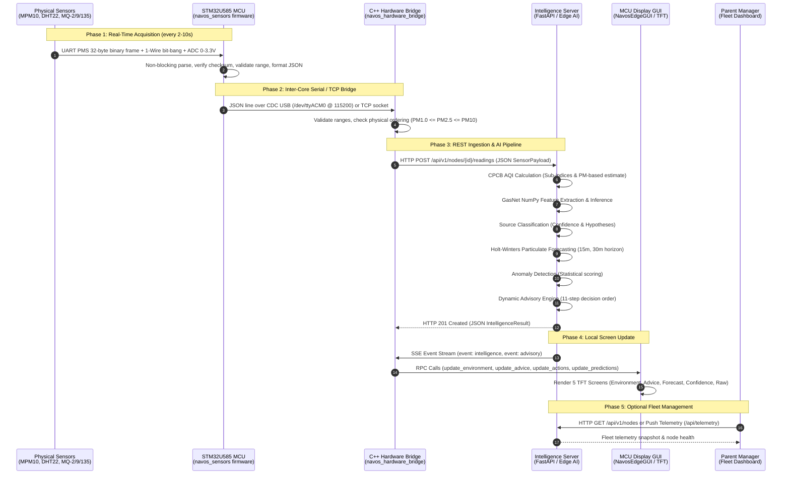

# NavosEdge — Complete End-to-End Data Flow Specification

## 1. Architectural Architecture & Data Path

NavosEdge implements an integrated data pipeline linking physical analog and digital transducers, a real-time ARM Cortex-M33 microcontroller, a high-performance C++ POSIX bridge, an asynchronous Python Edge AI server, a local 3.5" TFT display, and an optional parent fleet manager.



---

## 2. Detailed Pipeline Stages & Interface Contracts

### Stage 1: MCU Hardware Acquisition (`navos_sensors.ino`)
- **Execution Target**: STM32U585 ARM Cortex-M33 MCU.
- **Transducers**:
  - `MPM10-CS`: 9600-baud non-blocking state machine on `Serial1`. Checks 2-byte header (`0x42 0x4D`) and 16-bit payload checksum.
  - `DHT22`: Bit-banged 40-bit protocol on pin D8 every $\ge 2000\text{ms}$. Checks 8-bit CRC sum.
  - `MQ-2, MQ-9, MQ-135`: 10-bit ADC reads ($0–1023$) scaled to $0.0–3.3\text{V}$ input pin voltage.
- **Output Contract**: Normalized JSON string emitted over CDC Serial (`Serial`):
  ```json
  {
    "node_id": "uno-q-001",
    "sample_seq": 1042,
    "timestamp": "2026-10-09T01:15:13Z",
    "is_valid": true,
    "pms_ok": true,
    "dht_ok": true,
    "mq_ok": true,
    "mq_warmed": true,
    "gas_calibration_status": "UNSET",
    "mq2_adc": 345, "mq2_voltage": 1.686,
    "mq9_adc": 275, "mq9_voltage": 1.344,
    "mq135_adc": 415, "mq135_voltage": 2.028,
    "temperature_C": 26.5,
    "humidity_pct": 60.0,
    "pm1_0": 10.5,
    "pm2_5": 15.8,
    "pm10": 22.4
  }
  ```

---

### Stage 2: C++ Hardware Bridge (`navos_hardware_bridge`)
- **Execution Target**: Linux MPU.
- **Role**: Coordinates stream framing, physical boundary validation, and network transport.
- **Validation Pipeline (`SensorValidator`)**:
  - Drops corrupt frames where `is_valid == false`.
  - Enforces physical particulate ordering: $\text{PM1.0} \le \text{PM2.5} + 0.5 \le \text{PM10} + 0.5$.
  - Enforces physiological limits (Temperature $-40\text{ to }85^\circ\text{C}$, Humidity $0–100\%$, ADC $0–1023$).
- **Transport**: Transmits validated payload via HTTP Client (`libcurl`) to Intelligence Server.

---

### Stage 3: Python Intelligence Server (`Intelligence/Server`)
- **Endpoint**: `POST /api/v1/nodes/{node_id}/readings`
- **Modules Executed in Real Time**:
  1. **AQI Calculation (`AQICalculator`)**:
     - Computes CPCB linear sub-indices for $\text{PM}_{2.5}$ and $\text{PM}_{10}$.
     - Checks 3-pollutant regulatory sufficiency rule.
     - Emits `calculation_basis="PM_BASED_ESTIMATE"` and `cpcb_compliant=false`.
  2. **Feature Engineering & GasNet Inference (`NumpyGasNetAdapter`)**:
     - Extracts 5 normalized features: $[\text{norm}(V_{\text{MQ2}}), \text{norm}(V_{\text{MQ9}}), \text{norm}(V_{\text{MQ135}}), \text{norm}(T), \text{norm}(\text{RH})]$.
     - Executes 2-layer perceptron with calibrated temperature scaling ($T_{\text{cal}} = 2.80$).
  3. **Source Classifier (`SourceClassifier`)**:
     - Evaluates 14 statistical ratios and features.
     - Produces probability distribution across 8 classes.
  4. **Holt-Winters Forecaster (`ForecastPlugin`)**:
     - Predicts future 15-minute and 30-minute particulate trajectories.
     - Flags `RISING`, `FALLING`, or `STABLE` trend.
  5. **Advisory Engine (`AdvisoryEngine`)**:
     - Executes 11-step decision order.
     - Returns structured advisory with up to 3 prioritized actions ($<35$ chars each).

---

### Stage 4: Local MCU Display Rendering (`NavosEdgeGUI`)
- **Interface**: Inter-core RPC bridge (`update_environment`, `update_advice`, `update_actions`, `update_predictions`).
- **Display Hardware**: 3.5" ILI9486 TFT ($480 \times 320$ pixels).
- **Five Dedicated Screens**:
  - **Screen 0 (Environment)**: Hero AQI value, CPCB qualitative category pill (`Good`, `Satisfactory`, `Moderate`, `Poor`, `Very Poor`, `Severe`), CPCB theme colors, animated dust particles, PM10/PM2.5/PM1.0 progress bars, temperature and humidity.
  - **Screen 1 (Advice & Actions)**: Actionable health guidance, up to 3 discrete actions, color-coded severity badge.
  - **Screen 2 (Forecast)**: Short-term particulate horizon chart, trend status badge, confidence indicator.
  - **Screen 3 (Intelligence)**: Source hypothesis with cautious wording, anomaly score and classification certainty.
  - **Screen 4 (Raw Sensors)**: Engineering diagnostics screen showing raw ADC counts, pin voltages, and calibration status (`UNCALIBRATED`).

---

### Stage 5: Parent Fleet Manager (`Manager/`)
- **Role**: Optional central aggregator for multiple NavosEdge nodes across campus or city installations.
- **Endpoints**:
  - `POST /api/telemetry`: Node push telemetry.
  - `GET /api/nodes`: Dashboard fleet query with active/stale status tracking.
